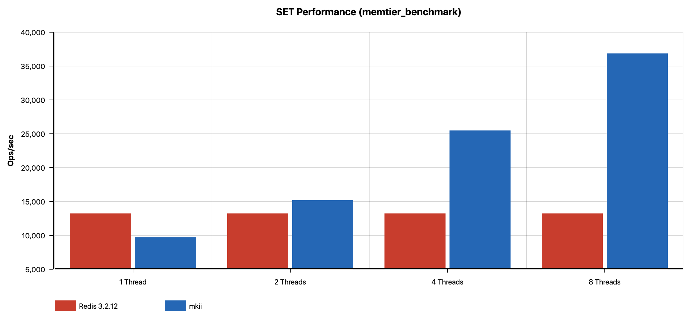
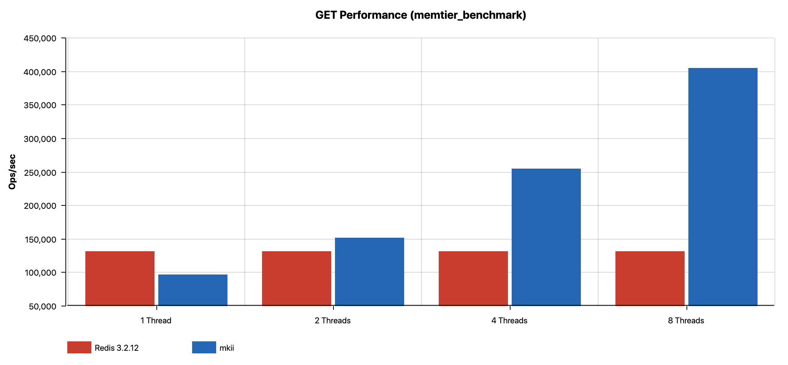

# mkii

A Redis compatible database. (*pronounced like mark 2*)

***mkii is not feature complete nor production ready***

mkii is a experimental implementation of the Redis database in Rust built around async/await and tokio. mkii goes a tiny step further and leverages [tokio-io-pool](https://github.com/jonhoo/tokio-io-pool) and is conceptually implemented in a thread-per-core manner, a design inspired by the [Seastar](http://seastar.io/) framework (which underpins [ScyllaDB](https://www.scylladb.com/). As a result mkii is able to salably take advantage of multi core systems, while avoid the pitfalls of a thread per connection model.

## Motivation

**mkii is my first Rust project and was developed primarily in my spare time to learn Rust and tokio**. I developed mkii heavily for a some time in 2018, then only recently updated it to work with the new stabilized async/await syntax. As a result, mkii lacks stability (no tests!), and also many features important to a database (such as persistence and configuration) are not implemented.

Primarily I'm using the project to understand how concepts like persistence and transactions can be implemented performantly in a modern in-memory database in Rust. However, I'm open sourcing this project to get feedback and as a chance to learn from others.

## Architecture

mkii works primarily by creating `tokio-io-pool` with the same number of threads as cores on the system. This is a special kind of tokio reactor in that a task - or a chain of futures - will by default always be scheduled on the same thread. By sharding the database keyspace evenly among each thread, you can have each thread serve requests on a subset of the database in parallel with each other. This is similar to running multiple redis instances on a single machine to improve performance, but having the sharding logic inside the database itself. Each thread stores a pointer to its hashtable in thread-local storage.

When a connection is created, the thread that initiated that connection can serve the request (if the command received is in the keyspace of that thread) or it can send that request to the appropriate thread via message passing.

## Completeness

mkii only implements a small surface of Redis and does not implement any persistence or transactions.

Regarding persistence and transactions I'm going back to the database literature and papers to try and understand what methods may have the best tradeoffs and be the most enjoyable to implement.

### Supported Commands

| Command | Status |
| ------- | ------ |
| GET	| ✔️|
| SET	| ✔️|
| SETNX	| ✔️|
| SETEX |	✔️|
| PSETEX |	✔️|
| APPEND |	✔️|
| STRLEN |	✔️|
| DEL |	✔️|
| UNLINK |	✔️|
| EXISTS |	✔️|
| SETBIT |	✔️|
| GETBIT |	✔️|
| BITFEILD |	✔️|
| SETRANGE |	✔️|
| GETRANGE |	✔️|
| SUBSTR |	✔️|
| INCR |	✔️|

## Performance

mkii single core performance is 35% slower than Redis v3.2.12 - however mkii scales with more cores as Redis performance stays relatively flat. The following benchmarks were run with 2 `n1-highcpu-8` machines - one running the database and the other running [https://github.com/RedisLabs/memtier_benchmark](https://github.com/RedisLabs/memtier_benchmark).

`memtier_benchmark -s 10.128.0.2 -t 8`

 

## Getting Started

mkii requires Rust nightly 1.39.0 as it depends on the stabilized async/await and futures. Cloning the directory and running `cargo run` should start mkii. Then using any redis client or `redis-cli` you can connect to `localhost:6379`.

## License

MIT
